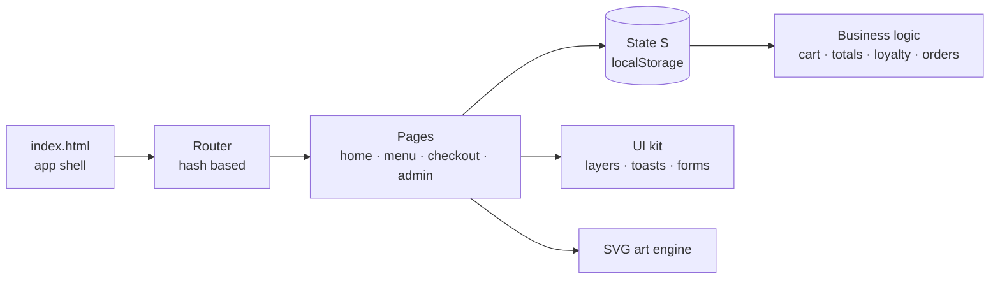

<div align="center">


# Ember & Crust

### Pizza & Burger Co. — Bengaluru

**A complete food-ordering experience in pure HTML, CSS and JavaScript.**
Browse. Customise. Checkout. Track. Earn rewards. Run the kitchen.

<br />


[**Live Demo**](http://embercrest.netlify.app/) &nbsp;·&nbsp; [**Quick Start**](#-quick-start) &nbsp;·&nbsp; [**Features**](#-features) &nbsp;·&nbsp; [**Demo Access**](#-demo-access) &nbsp;·&nbsp; [**Deploy**](#-deploy-to-github-pages)

</div>

<br />

> [!NOTE]
> This is a **front-end demo**. Payments, accounts, orders and the admin panel are simulated in the browser and stored in `localStorage`. See [Production Notes](#-production-notes) before using it for a real business.

---

## ✨ Highlights

<table>
<tr>
<td width="25%" align="center"><h3>43</h3>menu items<br />across 8 categories</td>
<td width="25%" align="center"><h3>4</h3>branches<br />with live open/closed status</td>
<td width="25%" align="center"><h3>3</h3>experiences<br />customer · admin · kitchen</td>
<td width="25%" align="center"><h3>0</h3>dependencies<br />no framework, no build</td>
</tr>
</table>

---

## 🍽 Features

<table>
<tr>
<td valign="top" width="50%">

### 🛒 Ordering
- Search, filters (veg, spicy, price, rating) and 5 sort modes
- Deep customisation: size, crust, toppings, sauces, add-ons
- "Frequently bought together" one-tap bundles
- Smart cart with in-place editing and coupons
- 4-step checkout: UPI, card, wallet, cash on delivery
- Delivery or pickup, per-branch ETA

</td>
<td valign="top" width="50%">

### 📦 After the order
- Live tracking with auto-progressing stages
- Order history and one-tap reorder
- Saved addresses and favourites
- Reviews with verified-purchase badges
- Notifications centre
- Support requests per order

</td>
</tr>
<tr>
<td valign="top">

### 🏆 Loyalty & offers
- 1 point per ₹10 spent
- Four tiers: **Regular → Silver → Gold → VIP**
- Free-delivery thresholds and bonus points per tier
- BOGO, student, family, weekend and limited-time deals
- Countdown timers on expiring offers

</td>
<td valign="top">

### 🧑‍🍳 Operations
- **Owner dashboard:** sales KPIs, charts, order workflow, products, coupons, customers, reviews, analytics
- **Kitchen display:** live ticket board
- "Simulate order" and demo auto-progress for presentations

</td>
</tr>
</table>

### 🎨 Craft

| | |
|---|---|
| **Illustrated food art** | Every dish is generated as inline SVG. No image files needed. |
| **Accessible** | Skip link, ARIA labels, focus trapping, full keyboard support, reduced-motion respect |
| **Responsive** | Fluid layout with a mobile bottom navigation bar |
| **SEO-ready** | Per-page meta, Open Graph, JSON-LD for `Restaurant`, `Menu` and product schema |
| **Themes** | Light and dark, follows system preference with a manual toggle |

---

## 🚀 Quick Start

No install. No build.

```bash
git clone https://github.com/theviping/EmberCrest.git
cd EmberCrest
```

Open `index.html` directly, or serve it locally:

```bash
python3 -m http.server 8000     # then visit http://localhost:8000
# or
npx serve .
```

> [!TIP]
> Fonts load from Google Fonts. Offline, the site gracefully falls back to system fonts.

---

## 🔑 Demo Access

<table>
<tr>
<th>Role</th><th>Login</th><th>Password</th><th>Where</th>
</tr>
<tr>
<td>Customer</td><td><code>aarav@example.com</code></td><td><code>demo1234</code></td><td><code>#/account</code></td>
</tr>
<tr>
<td>Admin</td><td><code>admin@emberandcrust.in</code></td><td><code>admin123</code></td><td><code>#/admin</code></td>
</tr>
</table>

<details>
<summary><b>Test cards and coupon codes</b></summary>

<br />

**Cards**

| Number | Result |
|---|---|
| `4242 4242 4242 4242` | ✅ Success |
| `4000 0000 0000 0002` | ❌ Declined |

**Coupons**

| Code | Offer |
|---|---|
| `WELCOME20` | 20% off, up to ₹150 (min ₹199) |
| `FLAT100` | ₹100 off above ₹599 |
| `FREESHIP` | Free delivery above ₹299 |
| `STUDENT15` | 15% off, up to ₹100 |
| `WEEKEND25` | 25% off above ₹499, up to ₹200 |

</details>

---

## 🧭 Routes

<details>
<summary><b>View all routes</b></summary>

<br />

| Route | Page |
|---|---|
| `#/` | Home |
| `#/menu` · `#/menu/<category>` | Menu and categories |
| `#/product/<slug>` | Product detail |
| `#/offers` | Offers and deals |
| `#/checkout` | Checkout |
| `#/track` | Order tracking |
| `#/account` | Account, orders, addresses |
| `#/rewards` | Loyalty program |
| `#/locations` | Branch locator |
| `#/about` · `#/contact` | About and contact |
| `#/admin` | Owner dashboard |
| `#/kitchen` | Kitchen display |

</details>

---

## 🏗 Architecture



<details>
<summary><b>Project structure</b></summary>

<br />

```
Ember-&-Crust/
├── index.html              App shell, meta tags, JSON-LD
├── css/
│   ├── style1.css          Design tokens, base, themes
│   ├── style2.css          Components, menu, product modal
│   └── style3.css          Checkout, account, admin, responsive
└── js/                     Loaded in order. No bundler.
    ├── 01-core.js          Helpers, brand config, icons
    ├── 02-art.js           Generated SVG food illustrations
    ├── 03-data.js          Products, categories, coupons, branches
    ├── 04-state.js         State, persistence, seed data, logic
    ├── 05-ui.js            Dialogs, toasts, shared components
    ├── 06-product.js       Product modal, customisation, reviews
    ├── 07-home.js          Router and home page
    ├── 08-menu-offers.js   Menu, filters, offers
    ├── 09-pages2.js        About, contact, locations, rewards, policies
    ├── 10-checkout.js      Checkout, tracking, account, auth
    ├── 11-admin.js         Admin dashboard and kitchen display
    └── 12-main.js          Boot and global events
```

Scripts share one global scope, so **load order matters**. Keep the numeric prefixes and the order in `index.html`.

</details>

---

## 🎛 Customising

| I want to change… | Edit |
|---|---|
| Brand name, phone, delivery fee, GST, minimum order | `BRAND` in `js/01-core.js` |
| Menu items, coupons, branches | `js/03-data.js` |
| Loyalty tiers, order-stage timing | `TIERS`, `STAGE_MS` in `js/04-state.js` |
| Colours and fonts | CSS variables at the top of `css/style1.css` |

**Reset all demo data**

```js
localStorage.removeItem('ember_crust_v1'); location.reload();
```

---

## 🌐 Deploy to GitHub Pages

The site is fully static with hash routing, so it works on Pages as-is.

1. Push the project files with `index.html` at the repository root.
2. Open **Settings → Pages**.
3. Under **Build and deployment**, choose **Deploy from a branch**, select `main` and `/ (root)`, then save.
4. Your site goes live at `https://theviping.github.io/EmberCrest/`.

> [!IMPORTANT]
> Update the placeholder `emberandcrust.example` URLs in `index.html` (canonical link and JSON-LD) once you have your live address.

---

## 🛡 Production Notes

To turn this demo into a real ordering platform you would need to:

- [ ] Replace `localStorage` with a real backend and database
- [ ] Integrate a payment gateway (Razorpay, Stripe, etc.)
- [ ] Move authentication server-side. The demo credentials in client code are **not secure**
- [ ] Replace simulated orders and status progression with real order and kitchen events

---

## 🧰 Tech Stack

HTML5 · CSS3 (custom properties, grid, flexbox) · Vanilla JavaScript (ES2020) · Inline SVG · Web Storage · Google Fonts (Bricolage Grotesque, DM Sans)

---

<br />

<div align="center">

**Made with ❤️ **

⭐ Star this repo if you liked it

</div>
